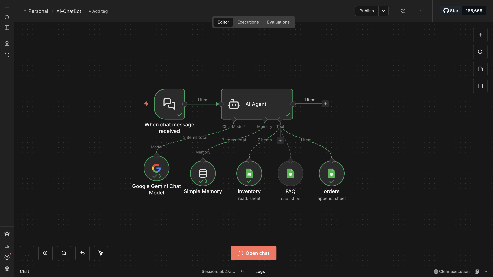
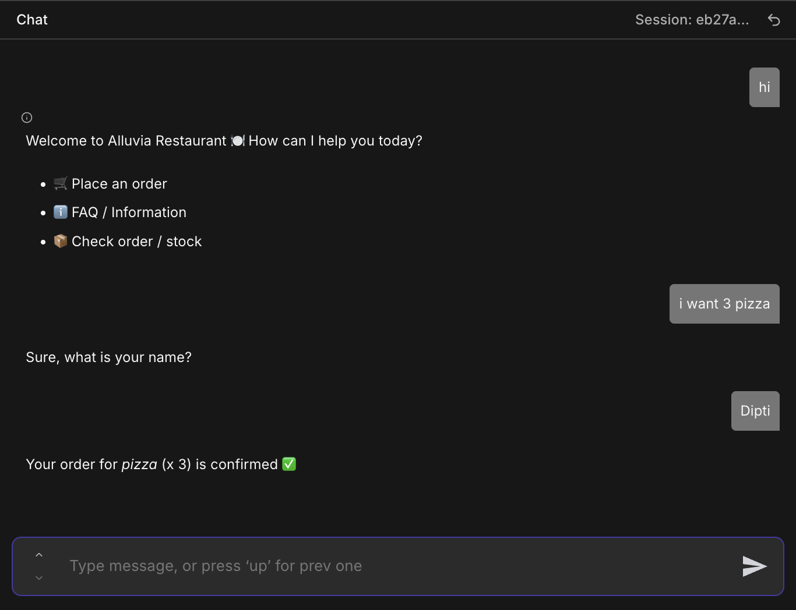

# 🍕 Food-Order-ChatBot 

An AI-powered conversational agent built using **n8n**, **Google Gemini**, and **Google Sheets**. This bot handles the end-to-end restaurant experience—from answering FAQs to managing inventory and logging live orders.

---

## 📸 Project Showcase

### **The Conversation Flow**
The AI Agent intelligently handles order logic, identifying missing information (like the customer's name) before confirming.

### **The Workflow Logic**
Built on n8n, this 3-layer pipeline connects the Gemini model to real-time data sources.

### **Execution Logs**
Detailed logs showing the AI Agent's thought process and tool usage during a live session.

---

## 🚀 Key Features

* **Conversational Ordering:** Natural language processing for a seamless customer experience.
* **Dynamic Inventory Check:** Real-time stock verification via the `inventory` Google Sheet.
* **Contextual Memory:** Uses **Simple Window Buffer Memory** to maintain state across multiple chat turns.
* **Automated Bookkeeping:** Orders are instantly appended to the `orders` sheet upon confirmation.
* **Instant FAQ:** A dedicated knowledge base for lightning-fast restaurant info.

## 🛠️ Tech Stack

* **Automation:** [n8n.io](https://n8n.io/)
* **LLM:** Google Gemini 1.5
* **Database:** Google Sheets
* **Agent Framework:** LangChain (Integrated in n8n)

---

## ⚙️ Setup & Configuration

1.  **Google Sheets Setup:** Create `inventory`, `FAQ`, and `orders` sheets.
2.  **API Keys:** Configure your **Google Gemini API Key** and **Google Service Account**.
3.  **n8n Import:** Import your `.json` workflow and link your credentials to the node parameters.

---

#📝 Example Interaction

---

## 👩‍💻 Developed By
**Dipti Singh** | *Aspiring Software Engineer* [GitHub](https://github.com/dipti-2211) | [LinkedIn](https://www.linkedin.com/in/dipti-singh-493406281/)
